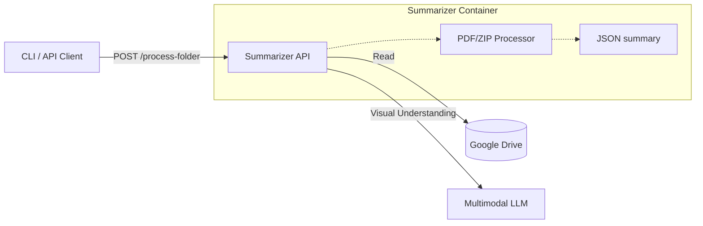
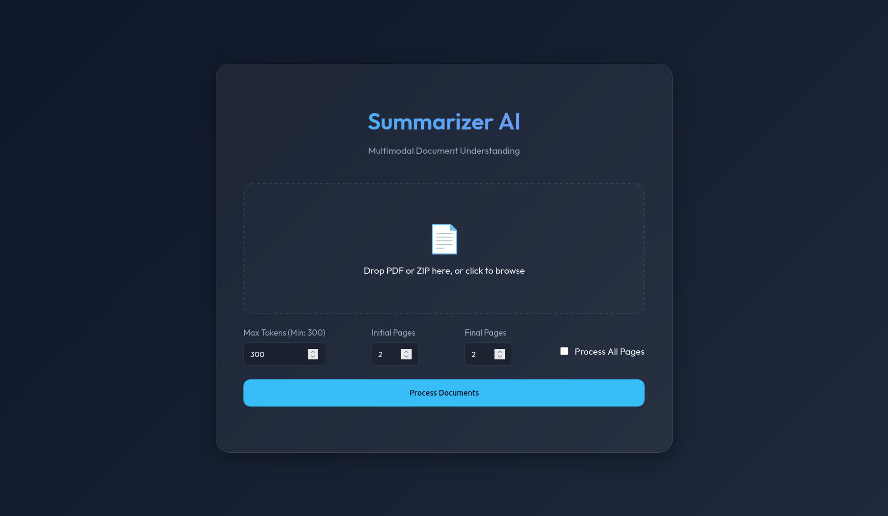

# Summarizer Microservice

Aplicación multimodal diseñada para procesar, resumir y mejorar metadatos de documentos (PDFs y ZIPs) usando LLMs avanzados con capacidad de análisis visual.

## 🏗 Arquitectura

Este microservicio actúa como un nodo de procesamiento inteligente en un pipeline de documentos. Está diseñado para ser **stateless**, **escalable** y **agnóstico al entorno**.

### Flujo de Alto Nivel
1.  **Entrada**: Recibe una referencia a un documento (PDF o ZIP) vía API o CLI.
    *   Fuentes soportadas: Google Drive (principal), Sistema de archivos local, Carga directa.
2.  **Procesamiento**:
    *   **PDF**: Extrae visuales clave (primeras/últimas páginas configurables) y texto. Usa un LLM Multimodal para generar una descripción semántica.
    *   **ZIP**: Extrae, procesa individualmente los PDFs contenidos y **genera un macro-resumen semántico** de toda la colección.
3.  **Salida**: Retorna un JSON estructurado con resúmenes semánticos, listo para indexación o actualización de metadatos.

### Diagrama de Componentes


## 💡 Modos de Operación

El servicio soporta diferentes modos de operación según la fuente de los documentos:

| Modo | Fuente de Entrada | Disponibilidad | Caso de Uso Principal |
| :--- | :--- | :--- | :--- |
| `gdrive` | Google Drive | **API y CLI** | **Producción**. Procesamiento de carpetas compartidas de Google Drive. Modo principal del servicio. |
| `local` | Sistema de archivos | **CLI únicamente** | **Desarrollo/Debug**. Procesamiento de archivos locales desde la línea de comandos. |
| `upload` | POST Directo | **API únicamente** (web) | **Web UI / Pruebas Rápidas**. Carga manual con controles avanzados (selección de páginas, max tokens, exportación JSON). |

### Características Web UI
- **Control de Páginas**: Selecciona páginas iniciales/finales o "Procesar Todo".
- **Exportación**: Descarga todos los resultados procesados como un único archivo JSON.
- **Seguridad**: Límite mínimo de 300 tokens para garantizar JSON válido.
- **Feedback**: Barra de progreso y listado de archivos.



## 🚀 Inicio Rápido

### Prerrequisitos
- Docker & Docker Compose
- Credenciales de Google Drive API (para modo Google Drive)

1.  **Clonar el repositorio**
2.  **Configurar variables de entorno**
    ```bash
    cp .env.example .env
    ```
    
    Y editar .env con tu configuración específica.

3.  **Iniciar servicios**
    ```bash
    docker-compose up --build
    ```
    Esto inicia:
    - `summarizer`: El servicio API (e.g. puerto 8567)

4.  **Acceder a las interfaces**
    - **Web UI**: [http://localhost:8567/](http://localhost:8567/) - ¡Arrastra aquí tus archivos!
    - **OpenAPI / Swagger UI**: [http://localhost:8567/docs](http://localhost:8567/docs)

5.  **Verificar conectividad con Google Drive** (opcional)
    ```bash
    curl http://localhost:8567/health/gdrive
    ```
    Respuesta esperada:
    ```json
    {
      "status": "ok",
      "message": "Google Drive connection successful",
      "files_visible": 1
    }
    ```

> [!IMPORTANT]
> **Shared Drives (Unidades Compartidas)**: Este servicio soporta tanto "Mi unidad" como "Unidades compartidas" de Google Drive. Asegúrate de compartir las carpetas con el email de la Service Account (`client_email` en tu archivo de credenciales).


## 🛠 Uso de la API

### Endpoint Principal: `POST /process-folder`

Procesa todos los archivos PDF y ZIP de una carpeta de Google Drive y retorna un manifest JSON con todos los resultados ordenados.

#### Ejemplo 1: Procesar carpeta por ID con configuración por defecto
```bash
curl -X POST "http://localhost:8567/process-folder" \
  -H "Content-Type: application/json" \
  -d '{
    "folder_id": "1C4X9NnTiwFGz3We2D4j-VpINHgCVjV4Y",
    "language": "es"
  }'
```

#### Ejemplo 2: Procesar subcarpetas por nombre (Opcional: ID padre explícito o desde .env)

```bash
# A: Solo especificando el nombre (usa variable de entorno GOOGLE_DRIVE_FOLDER_ID)
curl -X POST "http://localhost:8567/process-folder" \
  -H "Content-Type: application/json" \
  -d '{"folder_name": "2005", "language": "es"}'

# B: Especificando el ID padre explícito y el nombre
curl -X POST "http://localhost:8567/process-folder" \
  -H "Content-Type: application/json" \
  -d '{
    "parent_folder_id": "16JqSg7BuAE_o1wkFM4q4QUWXMgLRcjFh",
    "folder_name": "2005",
    "language": "es"
  }'
```

O con parámetros personalizados:

```bash
curl -X POST "http://localhost:8567/process-folder" \
  -H "Content-Type: application/json" \
  -d '{
    "folder_id": "16JqSg7BuAE_o1wkFM4q4QUWXMgLRcjFh",
    "language": "es",
    "initial_pages": 3,
    "final_pages": 4
  }'
```

**Nota**: Los parámetros `initial_pages` y `final_pages` son opcionales y tienen un valor por defecto de 2 cada uno. Permiten especificar cuántas páginas iniciales y finales de cada PDF se procesarán para el análisis.

#### Respuesta típica

```json
{
  "folder_id": "16JqSg7BuAE_o1wkFM4q4QUWXMgLRcjFh",
  "folder_name": "Beetlejuice",
  "processed_at": "2024-01-15T10:30:00",
  "total_files": 5,
  "results": [
    {
      "id": "file123",
      "name": "documento.pdf",
      "description": "Contrato de servicios...",
      "type": "pdf",
      "path": "2005/documento.pdf",
      "metadata": {...}
    }
  ],
  "manifest": {
    "folder_id": "...",
    "processed_at": "...",
    "total_files": 5,
    "files": [...]
  }
}
```

### Endpoint: `POST /summarize`

Endpoint genérico para procesar documentos individuales desde diferentes fuentes. Útil para procesar archivos específicos.

#### Modo 1: Google Drive (recomendado)

**Ejemplo A: Procesar archivo específico por `file_id` directo**
```bash
curl -X POST "http://localhost:8567/summarize" \
  -H "Content-Type: application/json" \
  -d '{
    "documents": [{
      "id": "mi-doc-especifico",
      "type": "pdf",
      "source": {
        "mode": "gdrive",
        "file_id": "1meKomn0YlFBHa8HFt0XjDkHApiM7XJr5",
        "language": "es"
      }
    }]
  }'
```

**Ejemplo B: Procesar archivo por nombre dentro de una carpeta con parámetros personalizados**

```bash
curl -X POST "http://localhost:8567/summarize" \
  -H "Content-Type: application/json" \
  -d '{
    "documents": [
      {
        "id": "2-2005",
        "type": "pdf",
        "source": {
          "mode": "gdrive",
          "folder_id": "1C4X9NnTiwFGz3We2D4j-VpINHgCVjV4Y",
          "file_name": "2-2005.pdf",
          "language": "es",
          "initial_pages": 2,
          "final_pages": 2
        }
      }
    ]
  }'
```

#### Modo 2: Ruta Local
```bash
curl -X POST "http://localhost:8567/summarize" \
  -H "Content-Type: application/json" \
  -d '{
    "documents": [
      {
        "id": "doc1",
      "type": "pdf",
      "source": {
        "mode": "local",
        "path": "/data/sample.pdf",
        "language": "es",
        "initial_pages": 2,
        "final_pages": 2
      }
    }
  ]
}
```

#### Modo 3: Carga Directa (Web UI)
```bash
curl -X POST "http://localhost:8567/upload" \
  -H "accept: text/html" \
  -H "Content-Type: multipart/form-data" \
  -F "files=@/path/to/invoice.pdf"
```

## 💻 Uso del CLI

El CLI permite procesar documentos desde la línea de comandos. Soporta dos modos principales: **local** (archivos del sistema) y **gdrive** (Google Drive).

> [!IMPORTANT]
> **Ejecución del CLI**: Los comandos CLI deben ejecutarse **dentro del contenedor Docker** o en un entorno virtual con las dependencias instaladas.

### Opción 1: Ejecutar dentro del contenedor (Recomendado)
```bash
# Acceder al contenedor
docker exec -it summarizer bash

# Dentro del contenedor, ejecutar comandos CLI
python3 -m app.cli gdrive 1C4X9NnTiwFGz3We2D4j-VpINHgCVjV4Y --language es --output /data/manifest.json
```

### Opción 2: Ejecutar en entorno virtual local
```bash
# Crear y activar entorno virtual
python3 -m venv venv
source venv/bin/activate  # En Windows: venv\Scripts\activate

# Instalar dependencias
pip install -r requirements.txt

# Ejecutar comandos CLI
python3 -m app.cli gdrive 1C4X9NnTiwFGz3We2D4j-VpINHgCVjV4Y --language es --output manifest.json
```

### Procesar carpeta local

```bash
# Dentro del contenedor
docker exec -it summarizer bash

# Con configuración por defecto (2 páginas iniciales, 2 finales)
python3 -m app.cli local /ruta/a/carpeta --language es --output resultados.json

# Con configuración personalizada de páginas
python3 -m app.cli local /ruta/a/carpeta --language es --initial-pages 3 --final-pages 4 --output resultados.json
```

### Procesar carpeta de Google Drive

```bash
# Dentro del contenedor
docker exec -it summarizer bash

# Por ID de carpeta con configuración por defecto
python3 -m app.cli gdrive 1C4X9NnTiwFGz3We2D4j-VpINHgCVjV4Y --language es --output resultados.json

# Por URL completa con páginas personalizadas
python3 -m app.cli gdrive "https://drive.google.com/drive/u/0/folders/1C4X9NnTiwFGz3We2D4j-VpINHgCVjV4Y" --language es --initial-pages 3 --final-pages 3
```

### Ejemplo: Procesar carpeta de Google Drive
```bash
# Acceder al contenedor
docker exec -it summarizer bash

# Dentro del contenedor, procesar carpeta y guardar resultados
python3 -m app.cli gdrive 1C4X9NnTiwFGz3We2D4j-VpINHgCVjV4Y --output /data/manifest.json
```

### Ver ayuda del CLI
```bash
# Dentro del contenedor
docker exec -it summarizer bash

# Ayuda general
python3 -m app.cli --help

# Ayuda del comando local
python3 -m app.cli local --help

# Ayuda del comando gdrive
python3 -m app.cli gdrive --help
```

### Variables de Entorno

| Variable | Descripción | Default | Requerido |
| :--- | :--- | :--- | :--- |
| `MODEL_API_URL` | URL de Chat Completions del LLM | `http://192.168.4.32:4000/v1/chat/completions` | Sí |
| `MODEL_API_TOKEN` | Token de autenticación para la API del modelo (opcional) | `None` | No |
| `VLLM_MODEL` | Modelo multimodal para procesamiento de PDFs (con imágenes) | `mistralai/Mistral-Small-3.2-24B-Instruct-2506` | Sí |
| `LLM_MODEL` | Modelo de texto para macro-resúmenes de ZIP (más rápido) | `Qwen/Qwen3-32B` | Sí |
| `GOOGLE_DRIVE_ENABLED` | Habilitar servicio de Google Drive | `true` | Sí (para modo gdrive) |
| `GOOGLE_DRIVE_CREDENTIALS` | Ruta al archivo de credenciales JSON | `./secrets/google-credentials.json` | Sí (para modo gdrive) |
| `GOOGLE_DRIVE_FOLDER_ID` | ID de carpeta raíz (opcional, usado como fallback) | - | No |
| `API_PORT` | Puerto en el que se expone la API | `8567` | No |

## 🧠 Detalles de Implementación Lógica

### Estrategia de Resumen de PDF

En lugar de hacer OCR ciego de todo el documento, usamos una **Estrategia Multimodal**:

1.  **Renderizar**: Convierte las **primeras N** y **últimas M** páginas del PDF a imágenes de alta resolución (por defecto: 2 iniciales y 2 finales, configurable).
2.  **Prompt & Structured Output**:
    - **System Prompt**: *"You are a helpful assistant..."*
    - **JSON Schema**: Se impone un esquema estricto (`{"description": "string"}`) usando el modo **JSON Mode/Structured Outputs** del LLM para garantizar respuestas parseables.
3.  **Descripción**: La salida es una descripción densa en texto plano, parseada desde el JSON.

### Observabilidad
El servicio implementa logging estructurado a `stdout`, permitiendo trazar:
- Recepción de archivos.
- Conversión PDF -> Imágenes.
- Payload al LLM (configuración de tokens/schema).
- Respuesta raw del LLM y éxito del parseo.

**Configuración de páginas**: El número de páginas iniciales y finales a procesar es configurable mediante los parámetros `initial_pages` y `final_pages` (por defecto: 2 cada uno). Esto permite optimizar el procesamiento según el tipo de documento:
- Documentos cortos: usar menos páginas
- Documentos largos: usar más páginas iniciales/finales para capturar mejor el contexto

### Manejo de ZIP

1. Descomprimir a un directorio temporal.
2. Iterar a través de todos los archivos PDF encontrados recursivamente.
3. Resumir cada PDF individualmente usando la misma estrategia multimodal.
4. Agregador: Crear un resumen final describiendo la *colección* (ej: "Un conjunto de 5 facturas correspondientes a Q3 2024").

### Extracción de ID de Carpeta de Google Drive

El servicio puede extraer automáticamente el ID de carpeta de URLs de Google Drive:
- URL completa: `https://drive.google.com/drive/u/0/folders/16JqSg7BuAE_o1wkFM4q4QUWXMgLRcjFh`
- ID directo: `16JqSg7BuAE_o1wkFM4q4QUWXMgLRcjFh`

Ambos formatos son aceptados.

## Modelos disponibles

| Modelo                                            | Tipo / Descripción                                                        |
| ------------------------------------------------- | ---------------------------------------------------------------------------------- |
| **BAAI/bge-reranker-v2-m3**                       | Modelo **Reranker** (para ordenar resultados, búsquedas)                           |
| **cpatonn/Qwen3-VL-32B-Instruct-AWQ-4bit**        | Modelo multimodal **VL** (Vision + Language), Instruct, 32B parámetros, 4bit quant |
| **input_inspector**                               | Herramienta o modelo para inspección/diagnóstico, no un LLM típico                 |
| **meta-llama/Llama-3-3.3-70B-Instruct**           | Modelo **Llama 3**, 70B parámetros, instructivo (LLM solo texto)                   |
| **mistralai/Magistral-Small-2509**                | Modelo VLLM pequeño
| **mistralai/Ministral-3-14B-Instruct-2512**       | Modelo VLLM pequeño, 14B parámetros
| **mistralai/Mistral-Small-3.2-24B-Instruct-2506** | Modelo VLLM, 24B parámetros
| **openai/gpt-oss-120b**                           | GPT open source, 120B parámetros, solo texto                                       |
| **openai/whisper-large-v3-turbo**                 | Modelo de reconocimiento de voz (ASR), no texto/imagen                             |
| **Qwen/Qwen3-32B**                                | LLM texto solo, 32B parámetros                                                     |
| **Qwen/Qwen3-32B-AWQ**                            | Igual que anterior pero con cuantización AWQ para optimización                     |
| **Qwen/Qwen3-4B**                                 | LLM texto solo, 4B parámetros                                                      |
| **Qwen/Qwen3-8B-AWQ**                             | LLM texto solo, 8B parámetros, AWQ cuantizado                                      |
| **Qwen/Qwen3-Embedding-4B**                       | Modelo para generar embeddings vectoriales, no generación texto                    |
| **Qwen/Qwen3-Reranker-8B**                        | Modelo reranker, para clasificación/ordenación                                     |
| **Qwen/Qwen3-VL-235B-A22B-Instruct**              | Multimodal VL, muy grande (235B+), instructivo                                     |
| **Qwen/Qwen3-VL-32B-Thinking**                    | Multimodal VL 32B parámetros |
| **SmolPiper**                                     | -                        |
| **Snowflake/snowflake-arctic-embed-l-v2.0**       | Modelo embedding para vectores, tipo búsqueda o recomendación                      |

# TODO

- Que se pueda en los POST añadir modificar el parámetro de max_tokens, o incluso temperatura, etc. del modelo.