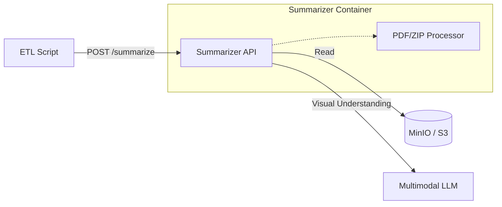

# Summarizer Microservice

A multimodal application designed to process, summarize, and enhance metadata for documents (PDFs and ZIPs) using advanced Layout-Aware LLMs.

## 🏗 Architecture

This microservice acts as an intelligent processing node in a document pipeline. It is designed to be **stateless**, **scalable**, and **environment-agnostic**.

### High-Level Flow
1.  **Input**: Receives a reference to a document (PDF or ZIP) via API.
    *   Supported sources: MinIO (S3), Local Filesystem (for debug), Direct Upload.
2.  **Processing**:
    *   **PDF**: Extracts key visuals (first/last pages) and text. Uses a Multimodal LLM to generate a semantic description.
    *   **ZIP**: Decompresses, recursively processes contained PDFs, and generates a "macro-description" of the collection.
3.  **Output**: Returns a structured JSON with semantic summaries, ready for indexing or metadata updates in Alfresco/Drive.

### Component Diagram


## 💡 Core Concepts and Data Flow

The architecture is designed around a **stateless processing model** where storage and processing are decoupled.

### 1. Storage-First Design
The Summarizer service does not typically receive large files directly from the client. Instead, it relies on shared storage (MinIO/S3).
*   **The Client (ETL)**: Uploads documents (PDFs/ZIPs) to the MinIO bucket first.
*   **The API Call**: Sends only the **references** (bucket name + object key) to the Summarizer.
*   **The Summarizer**: Downloads the file from the storage using the provided reference, processes it, and returns the result.

This approach ensures scalability and avoids transferring large payloads through the API.

### 2. Operation Modes
While the "S3 Mode" is the primary production workflow, the service supports other modes for development and testing.

| Mode | Input Source | Primary Use Case |
| :--- | :--- | :--- |
| **`s3`** | MinIO / S3 Bucket | **Production Pipelines**. The standard flow described above. |
| `local` | Mounted Volume | **Debugging**. Useful when the container has direct access to the host filesystem. |
| `upload` | Direct POST | **Web UI / Quick Testing**. Convenient for manual uploads or small files, but not recommended for high-volume pipelines. |

## 🚀 Getting Started

### Prerequisites
- Docker & Docker Compose

### Fast Start
1.  **Clone the repository**
2.  **Configure Environment**
    ```bash
    cp .env.example .env
    # Edit .env with your specific configuration if needed
    ```
3.  **Start services**
    ```bash
    docker-compose up --build
    ```
    This starts:
    - `summarizer`: The API service (Port 8000)
    - `minio`: S3-compatible storage (Port 9000 API / 9001 Console)

4.  **Access Interfaces**
    - **Web UI (Human Friendly)**: [http://localhost:8000/](http://localhost:8000/) - Drop your files here!
    - OpenAPI / Swagger UI: [http://localhost:8000/docs](http://localhost:8000/docs)
    - MinIO Console: [http://localhost:9001](http://localhost:9001)

## 🛠 API Usage

### Endpoint: `POST /summarize`

This generic endpoint accepts a **Task Definition**.

#### Mode 1: S3 / MinIO (Recommended for Production)
The service downloads the file from the specified bucket, processes it, and cleans up.

```json
{
  "mode": "s3",
  "bucket": "alfresco-temp",
  "key": "2024/contracts/fw_agreement.pdf",
  "language": "es"
}
```

#### Mode 2: Local Path (Debug / Dev)
Useful when running the container with a mounted volume (e.g., `-v /tmp/data:/data`).

```json
{
  "mode": "local",
  "path": "/data/sample.pdf"
}
```

#### Mode 3: Direct Upload
For quick tests or small files via the Web UI or API.

```bash
curl -X POST "http://localhost:8000/upload" \
  -H "accept: text/html" \
  -H "Content-Type: multipart/form-data" \
  -F "files=@/path/to/invoice.pdf"
```

## 🧩 Configuration

The project uses a `.env` file for configuration. See `.env.example`.

| Variable | Description |
| :--- | :--- |
| `S3_ENDPOINT` | URL of the S3 service |
| `S3_ACCESS_KEY` | S3 Access Key |
| `S3_SECRET_KEY` | S3 Secret Key |
| `LLM_API_URL` | Multimodal Chat Completions URL |
| `LLM_MODEL` | Model Name |

## 🧠 Logical Implementation Details

### PDF Summarization Strategy
Instead of blindly OCRing the entire document, we use a **Multimodal Strategy**:
1.  **Render**: Convert the **first 2** and **last 2** pages of the PDF to high-res images.
2.  **Prompt**: Send these images to the Vision-Language Model with a prompt focused on extraction of:
    *   Document Type (Contract, Invoice, Report...)
    *   Key Entities (Parties, Dates, Amounts)
    *   Subject Matter (Semantic summary)
3.  **Description**: The output is a dense, search-optimized description.

### ZIP Handling
1.  Unzip to a temporary directory.
2.  Iterate through all supported files.
3.  Summarize each individually.
4.  Aggregator: Create a final summary describing the *collection* (e.g., "A set of 5 invoices corresponding to Q3 2024").

## 📦 Project Structure

```
├── app/
│   ├── main.py              # FastAPI Entry point
│   ├── models.py            # Pydantic Schemas
│   └── services/
│       ├── storage.py       # S3/Local file handling
│       ├── pdf.py           # pdf2image logic
│       └── multimodal.py    # LLM Client
├── Dockerfile               # Production image definition
├── docker-compose.yml       # Local dev stack
└── requirements.txt         # Python dependencies
```
