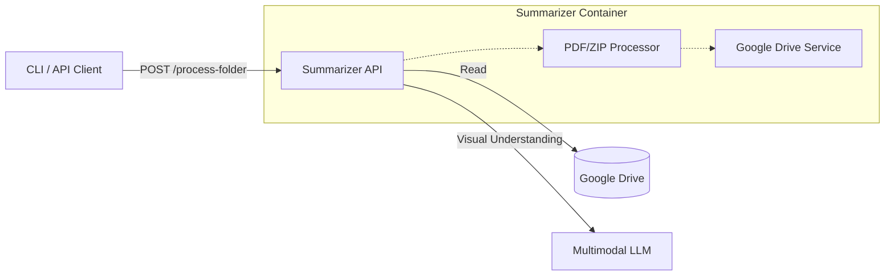

# Summarizer Microservice

Aplicación multimodal diseñada para procesar, resumir y mejorar metadatos de documentos (PDFs y ZIPs) usando LLMs avanzados con capacidad de análisis visual.

## 🏗 Arquitectura

Este microservicio actúa como un nodo de procesamiento inteligente en un pipeline de documentos. Está diseñado para ser **stateless**, **escalable** y **agnóstico al entorno**.

### Flujo de Alto Nivel
1.  **Entrada**: Recibe una referencia a un documento (PDF o ZIP) vía API o CLI.
    *   Fuentes soportadas: Google Drive (principal), Sistema de archivos local, Carga directa.
2.  **Procesamiento**:
    *   **PDF**: Extrae visuales clave (primeras/últimas páginas configurables) y texto. Usa un LLM Multimodal para generar una descripción semántica.
    *   **ZIP**: Descomprime, procesa recursivamente los PDFs contenidos, y genera una "macro-descripción" de la colección.
3.  **Salida**: Retorna un JSON estructurado con resúmenes semánticos, listo para indexación o actualización de metadatos.

### Diagrama de Componentes


## 💡 Modos de Operación

El servicio soporta diferentes modos de operación según la fuente de los documentos:

| Modo | Fuente de Entrada | Disponibilidad | Caso de Uso Principal |
| :--- | :--- | :--- | :--- |
| **`gdrive`** | Google Drive | **API y CLI** | **Producción**. Procesamiento de carpetas compartidas de Google Drive. Modo principal del servicio. |
| `local` | Sistema de archivos | **CLI únicamente** | **Desarrollo/Debug**. Procesamiento de archivos locales desde la línea de comandos. |
| `upload` | POST Directo | **API únicamente** | **Web UI / Pruebas Rápidas**. Carga manual de archivos a través de la interfaz web. |

## 🚀 Inicio Rápido

### Prerrequisitos
- Docker & Docker Compose
- Credenciales de Google Drive API (para modo Google Drive)

1.  **Clonar el repositorio**
2.  **Configurar variables de entorno**
    ```bash
    cp .env.example .env
    ```
    
    Editar .env con tu configuración específica, e.g.:
    ```env
    # Model Configuration
    MODEL_API_URL=http://foo/v1/chat/completions
    MODEL_API_TOKEN=foo
    MODEL_NAME=mistralai/Mistral-Small-3.2-24B-Instruct-2506

    # Google Drive Configuration
    GOOGLE_DRIVE_ENABLED=true
    GOOGLE_DRIVE_CREDENTIALS=./secrets/google-credentials.json
    GOOGLE_DRIVE_FOLDER_ID=foo

    # API Configuration
    API_PORT=8567
    ```

3.  **Iniciar servicios**
    ```bash
    docker-compose up --build
    ```
    Esto inicia:
    - `summarizer`: El servicio API (e.g. puerto 8000)

4.  **Acceder a las interfaces**
    - **Web UI**: [http://localhost:8000/](http://localhost:8000/) - ¡Arrastra tus archivos aquí!
    - **OpenAPI / Swagger UI**: [http://localhost:8000/docs](http://localhost:8000/docs)

**Primera autenticación con Google Drive**:
  - Al ejecutar el servicio por primera vez, se abrirá un navegador para autenticación, teniendo `gdrive_credentials.json`
  - Autoriza el acceso y el token se guardará automáticamente en `data/gdrive_token.pickle`

## 🛠 Uso de la API

### Endpoint Principal: `POST /process-folder`

Procesa todos los archivos PDF y ZIP de una carpeta de Google Drive y retorna un manifest JSON con todos los resultados ordenados.

#### Ejemplo 1: Procesar carpeta por ID con configuración por defecto
```bash
curl -X POST "http://localhost:8000/process-folder" \
  -H "Content-Type: application/json" \
  -d '{
    "folder_id": "16JqSg7BuAE_o1wkFM4q4QUWXMgLRcjFh",
    "language": "es"
  }'
```

#### Ejemplo 2: Procesar carpeta por ID con páginas personalizadas
```bash
curl -X POST "http://localhost:8000/process-folder" \
  -H "Content-Type: application/json" \
  -d '{
    "folder_id": "16JqSg7BuAE_o1wkFM4q4QUWXMgLRcjFh",
    "language": "es",
    "initial_pages": 3,
    "final_pages": 4
  }'
```

#### Ejemplo 3: Procesar carpeta por nombre dentro de otra carpeta
```bash
curl -X POST "http://localhost:8000/process-folder" \
  -H "Content-Type: application/json" \
  -d '{
    "parent_folder_id": "0AIMrYwrjYMzmUk9PVA",
    "folder_name": "2005",
    "language": "es",
    "initial_pages": 2,
    "final_pages": 2
  }'
```

#### Respuesta
```json
{
  "folder_id": "16JqSg7BuAE_o1wkFM4q4QUWXMgLRcjFh",
  "folder_name": "Beetlejuice",
  "processed_at": "2024-01-15T10:30:00",
  "total_files": 5,
  "results": [
    {
      "id": "file123",
      "name": "documento.pdf",
      "description": "Contrato de servicios...",
      "type": "pdf",
      "path": "2005/documento.pdf",
      "metadata": {...}
    }
  ],
  "manifest": {
    "folder_id": "...",
    "processed_at": "...",
    "total_files": 5,
    "files": [...]
  }
}
```

### Endpoint: `POST /summarize`

Endpoint genérico para procesar documentos individuales desde diferentes fuentes. Útil para procesar archivos específicos.

#### Modo 1: Google Drive (recomendado)
```json
{
  "documents": [
    {
      "id": "doc1",
      "type": "pdf",
      "source": {
        "mode": "gdrive",
        "folder_id": "16JqSg7BuAE_o1wkFM4q4QUWXMgLRcjFh",
        "language": "es",
        "initial_pages": 2,
        "final_pages": 2
      }
    }
  ]
}
```

#### Modo 2: Ruta Local
```json
{
  "documents": [
    {
      "id": "doc1",
      "type": "pdf",
      "source": {
        "mode": "local",
        "path": "/data/sample.pdf",
        "language": "es",
        "initial_pages": 2,
        "final_pages": 2
      }
    }
  ]
}
```

**Nota**: Los parámetros `initial_pages` y `final_pages` son opcionales y tienen un valor por defecto de 2 cada uno. Permiten especificar cuántas páginas iniciales y finales de cada PDF se procesarán para el análisis.

#### Modo 3: Carga Directa (Web UI)
```bash
curl -X POST "http://localhost:8000/upload" \
  -H "accept: text/html" \
  -H "Content-Type: multipart/form-data" \
  -F "files=@/path/to/invoice.pdf"
```

## 💻 Uso del CLI

El CLI permite procesar documentos desde la línea de comandos. Soporta dos modos principales: **local** (archivos del sistema) y **gdrive** (Google Drive).

### Procesar carpeta local

```bash
# Con configuración por defecto (2 páginas iniciales, 2 finales)
python -m app.cli local /ruta/a/carpeta --language es --output resultados.json

# Con configuración personalizada de páginas
python -m app.cli local /ruta/a/carpeta --language es --initial-pages 3 --final-pages 4 --output resultados.json

# Ver ayuda del comando local
python -m app.cli local --help
```

### Procesar carpeta de Google Drive

```bash
# Por ID de carpeta con configuración por defecto
python -m app.cli gdrive 16JqSg7BuAE_o1wkFM4q4QUWXMgLRcjFh --language es --output resultados.json

# Por URL completa con páginas personalizadas
python -m app.cli gdrive "https://drive.google.com/drive/u/0/folders/16JqSg7BuAE_o1wkFM4q4QUWXMgLRcjFh" --language es --initial-pages 3 --final-pages 3

# Con nombre de carpeta (opcional)
python -m app.cli gdrive 16JqSg7BuAE_o1wkFM4q4QUWXMgLRcjFh --name "Beetlejuice" --language es

# Ver ayuda del comando gdrive
python -m app.cli gdrive --help
```

**Parámetros de páginas**:
- `--initial-pages N`: Número de páginas iniciales a procesar de cada PDF (default: 2)
- `--final-pages N`: Número de páginas finales a procesar de cada PDF (default: 2)

### Ejemplo: Procesar carpeta de Google Drive
```bash
# Usando el ID de la carpeta compartida
python -m app.cli gdrive 16JqSg7BuAE_o1wkFM4q4QUWXMgLRcjFh --output manifest.json
```

El CLI buscará recursivamente todos los PDFs y ZIPs dentro de la carpeta especificada, los procesará, y generará un manifest JSON con todos los resultados ordenados.

### Ver ayuda del CLI
```bash
# Ayuda general
python -m app.cli --help

# Ayuda del comando local
python -m app.cli local --help

# Ayuda del comando gdrive
python -m app.cli gdrive --help
```

## 🧩 Configuración

El proyecto usa un archivo `.env` para configuración. Ver `.env.example`.

### Variables de Entorno

| Variable | Descripción | Default | Requerido |
| :--- | :--- | :--- | :--- |
| `MODEL_API_URL` | URL de Chat Completions del LLM | `http://localhost:11434/v1/chat/completions` | Sí |
| `MODEL_API_TOKEN` | Token de autenticación para la API del modelo (opcional) | `None` | No |
| `MODEL_NAME` | Nombre del Modelo | `mistralai/Mistral-Small-3.2-24B-Instruct-2506` | Sí |
| `GOOGLE_DRIVE_ENABLED` | Habilitar servicio de Google Drive | `true` | Sí (para modo gdrive) |
| `GOOGLE_DRIVE_CREDENTIALS` | Ruta al archivo de credenciales JSON | `/secrets/google-credentials.json` | Sí (para modo gdrive) |
| `GOOGLE_DRIVE_TOKEN_PATH` | Ruta donde guardar el token OAuth | `/data/gdrive_token.pickle` | No (se crea automáticamente) |
| `API_PORT` | Puerto en el que se expone la API | `8000` | No |

## 🧠 Detalles de Implementación Lógica

### Estrategia de Resumen de PDF

En lugar de hacer OCR ciego de todo el documento, usamos una **Estrategia Multimodal**:

1.  **Renderizar**: Convierte las **primeras N** y **últimas M** páginas del PDF a imágenes de alta resolución (por defecto: 2 iniciales y 2 finales, configurable).
2.  **Prompt**: Envía estas imágenes al Modelo de Lenguaje Visual con un prompt enfocado en extraer:
    *   Tipo de Documento (Contrato, Factura, Informe...)
    *   Entidades Clave (Partes, Fechas, Montos)
    *   Materia del Contenido (Resumen semántico)
3.  **Descripción**: La salida es una descripción densa, optimizada para búsqueda.

**Configuración de páginas**: El número de páginas iniciales y finales a procesar es configurable mediante los parámetros `initial_pages` y `final_pages` (por defecto: 2 cada uno). Esto permite optimizar el procesamiento según el tipo de documento:
- Documentos cortos: usar menos páginas
- Documentos largos: usar más páginas iniciales/finales para capturar mejor el contexto

### Manejo de ZIP

1. Descomprimir a un directorio temporal.
2. Iterar a través de todos los archivos PDF encontrados recursivamente.
3. Resumir cada PDF individualmente usando la misma estrategia multimodal.
4. Agregador: Crear un resumen final describiendo la *colección* (ej: "Un conjunto de 5 facturas correspondientes a Q3 2024").

### Extracción de ID de Carpeta de Google Drive

El servicio puede extraer automáticamente el ID de carpeta de URLs de Google Drive:
- URL completa: `https://drive.google.com/drive/u/0/folders/16JqSg7BuAE_o1wkFM4q4QUWXMgLRcjFh`
- ID directo: `16JqSg7BuAE_o1wkFM4q4QUWXMgLRcjFh`

Ambos formatos son aceptados.

## 📦 Estructura del Proyecto

```
├── app/
│   ├── main.py              # Punto de entrada FastAPI
│   ├── models.py            # Schemas Pydantic
│   ├── cli.py               # CLI para procesamiento local y Google Drive
│   └── services/
│       ├── storage.py       # Manejo de archivos (opcional)
│       ├── gdrive.py        # Servicio de Google Drive
│       ├── processor.py     # Lógica de procesamiento de documentos
│       ├── pdf.py           # Conversión PDF a imágenes
│       └── multimodal.py    # Cliente LLM
├── app/templates/
│   └── index.html           # Interfaz web para carga directa
├── Dockerfile               # Definición de imagen de producción
├── docker-compose.yml       # Stack de desarrollo local
└── requirements.txt         # Dependencias Python
```

## 🔍 Ejemplos de Uso

### Ejemplo 1: Procesar carpeta compartida de Google Drive desde API
```bash
# La carpeta compartida tiene ID: 16JqSg7BuAE_o1wkFM4q4QUWXMgLRcjFh
curl -X POST "http://localhost:8000/process-folder" \
  -H "Content-Type: application/json" \
  -d '{
    "folder_id": "16JqSg7BuAE_o1wkFM4q4QUWXMgLRcjFh",
    "language": "es"
  }' | jq '.manifest'
```

### Ejemplo 2: Procesar subcarpeta dentro de Google Drive
```bash
curl -X POST "http://localhost:8000/process-folder" \
  -H "Content-Type: application/json" \
  -d '{
    "parent_folder_id": "16JqSg7BuAE_o1wkFM4q4QUWXMgLRcjFh",
    "folder_name": "2005",
    "language": "es",
    "initial_pages": 3,
    "final_pages": 3
  }'
```

### Ejemplo 3: Procesar desde CLI y guardar resultados
```bash
python -m app.cli gdrive 16JqSg7BuAE_o1wkFM4q4QUWXMgLRcjFh \
  --language es \
  --output /data/manifest_beetlejuice.json
```

### Ejemplo 4: Procesar carpeta local con configuración personalizada
```bash
python -m app.cli local /data/documentos --language es --initial-pages 3 --final-pages 4 --output resultados.json
```

### Ejemplo 5: Ver ayuda del CLI
```bash
# Ayuda general
python -m app.cli --help

# Ayuda del comando local
python -m app.cli local --help

# Ayuda del comando gdrive
python -m app.cli gdrive --help
```

## Modelos disponibles

| Modelo                                            | Tipo / Descripción probable                                                        |
| ------------------------------------------------- | ---------------------------------------------------------------------------------- |
| **cpatonn/Qwen3-VL-32B-Instruct-AWQ-4bit**        | Modelo multimodal **VL** (Vision + Language), Instruct, 32B parámetros, 4bit quant |
| **mistralai/Magistral-Small-2509**                | Modelo VLLM pequeño
| **mistralai/Ministral-3-14B-Instruct-2512**       | Modelo VLLM pequeño, 14B parámetros
| **mistralai/Mistral-Small-3.2-24B-Instruct-2506** | Modelo VLLM, 24B parámetros
| **Qwen/Qwen3-VL-235B-A22B-Instruct**              | Multimodal VL, muy grande (235B+), instructivo                                     |
| **Qwen/Qwen3-VL-32B-Thinking**                    | Multimodal VL 32B parámetros |
