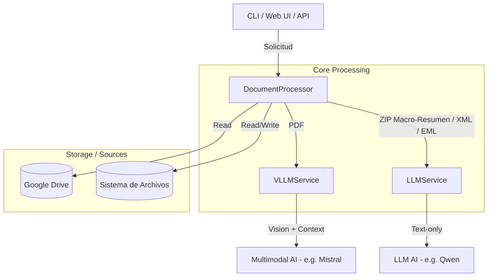

# Summarizer Microservice

Aplicación multimodal diseñada para procesar, resumir y mejorar metadatos de documentos (PDFs, ZIPs, XMLs y EMLs) usando LLMs avanzados con capacidad de análisis visual.

## 🏗 Arquitectura

Este microservicio actúa como un nodo de procesamiento inteligente en un pipeline de documentos. Está diseñado para ser **stateless**, **escalable** y **agnóstico al entorno**.

### Flujo de Alto Nivel
1.  **Entrada**: Recibe una referencia a un documento (PDF, ZIP, XML o EML) vía API o CLI.
    *   Fuentes soportadas: Google Drive (principal), Sistema de archivos local, Carga directa.
2.  **Procesamiento**:
    *   **PDF**: Extrae visuales clave (primeras/últimas páginas configurables) y texto. Usa un LLM Multimodal para generar una descripción semántica.
    *   **ZIP**: Extrae, procesa individualmente los PDFs contenidos y **genera un macro-resumen semántico** de toda la colección.
    *   **XML**: Extrae el contenido de texto del XML y usa un LLM de texto para generar una descripción semántica.
    *   **EML**: Extrae información del email (asunto, remitente, cuerpo) y usa un LLM de texto para generar una descripción semántica.
3.  **Salida**: Retorna un JSON estructurado con resúmenes semánticos, listo para indexación o actualización de metadatos.

### Diagrama de Componentes


Árbol de directorios:

```bash
alejandro@alejandro-XPS-14-9440:/opt/summarizer$ tree
.
├── app
│   ├── cli.py
│   ├── main.py
│   ├── models.py
│   ├── services
│   │   ├── gdrive.py
│   │   ├── llm.py
│   │   ├── vllm.py
│   │   ├── pdf.py
│   │   └── processor.py
│   └── templates
│       └── index.html
├── assets
│   ├── favicon.png
│   └── webui.png
├── data
│   └── manifest_beetlejuice.json
├── docker-compose.yml
├── Dockerfile
├── README.md
├── requirements.txt
└── secrets
    └── google-credentials.json
```

## 💡 Modos de Operación

El servicio soporta diferentes modos de operación según la fuente de los documentos:

| Modo | Fuente de Entrada | Disponibilidad | Caso de Uso Principal |
| :--- | :--- | :--- | :--- |
| `gdrive` | Google Drive | **API y CLI** | **Producción**. Procesamiento de carpetas compartidas de Google Drive. Modo principal del servicio. |
| `local` | Sistema de archivos | **CLI** | **Desarrollo/Debug**. Procesamiento de archivos locales desde la línea de comandos. |
| `upload` | POST Directo | **API** (web) | **Web UI / Pruebas Rápidas**. Carga manual con controles avanzados (selección de páginas, max tokens, exportación JSON). |

### 🌐 Características Web UI
- **Control de Páginas**: Selecciona páginas iniciales/finales o "Procesar Todo".
- **Exportación**: Descarga todos los resultados procesados como un único archivo JSON.
- **Seguridad**: Límite mínimo de 1024 tokens para garantizar JSON válido.
- **Feedback**: Barra de progreso y listado de archivos.


## 🚀 Inicio Rápido

### Prerrequisitos
- Docker & Docker Compose
- Credenciales de Google Drive API en `secrets/google-credentials.json` (para modo Google Drive)

1.  **Clonar el repositorio**
2.  **Configurar variables de entorno**
    ```bash
    cp .env.example .env
    ```
    
    Y editar .env con tu configuración específica.

3.  **Iniciar servicios**
    ```bash
    docker compose up --build
    ```
    Esto inicia:
    - `summarizer`: El servicio API (e.g. puerto 8567)

4.  **Acceder a las interfaces**
    - **Web UI**: [http://localhost:8567/](http://localhost:8567/) - Arrastra aquí tus archivos
    - **OpenAPI / Swagger UI**: [http://localhost:8567/docs](http://localhost:8567/docs)

5.  **Verificar conectividad** (opcional)
    ```bash
    # Google Drive
    curl http://localhost:8567/health/gdrive

    # LLM (Texto)
    curl http://localhost:8567/health/llm

    # VLLM (Multimodal)
    curl http://localhost:8567/health/vllm
    ```

> [!IMPORTANT]
> **Shared Drives (Unidades Compartidas)**: Este servicio soporta tanto "Mi unidad" como "Unidades compartidas" de Google Drive. Se debe asegurar de compartir las carpetas con el email de la Service Account (`client_email` en el archivo de credenciales).


## 🛠 Uso de la API

### Endpoint Principal: `POST /process-folder`

Procesa todos los archivos PDF, ZIP, XML y EML de una carpeta de Google Drive y retorna un JSON con todos los resultados ordenados.

#### Ejemplo 1: Procesar carpeta por ID con configuración por defecto
```bash
curl -X POST "http://localhost:8567/process-folder" \
  -H "Content-Type: application/json" \
  -d '{
    "folder_id": "1C4X9NnTiwFGz3We2D4j-VpINHgCVjV4Y",
    "language": "es"
  }'
```

#### Ejemplo 2: Procesar subcarpetas por nombre (Opcional: ID padre explícito o desde .env)

```bash
# A: Solo especificando el nombre de la carpeta de interés (se usa la variable de entorno GOOGLE_DRIVE_FOLDER_ID para la carpeta padre)
curl -X POST "http://localhost:8567/process-folder" \
  -H "Content-Type: application/json" \
  -d '{"folder_name": "2005", "language": "es"}'

# Y para redirigir el resultado fácilmente (y con parámetros personalizados):
curl -X POST "http://localhost:8567/process-folder" \
  -H "Content-Type: application/json" \
  -d '{
    "folder_name": "TEST", 
    "language": "es",
    "initial_pages": 2,
    "final_pages": 2,
    "max_tokens": 512
  }' \
  | jq . > summary_TEST.json

# B: Especificando el ID de la carpeta padre explícitamente y el nombre de la carpeta de interés 
curl -X POST "http://localhost:8567/process-folder" \
  -H "Content-Type: application/json" \
  -d '{
    "parent_folder_id": "16JqSg7BuAE_o1wkFM4q4QUWXMgLRcjFh",
    "folder_name": "2005",
    "language": "es"
  }'
```

**Nota**: Los parámetros `initial_pages` y `final_pages` son opcionales y tienen un valor por defecto de 2 cada uno. Permiten especificar cuántas páginas iniciales y finales de cada PDF se procesarán para el análisis.

#### Respuesta típica

```json
{
  "folder_id": "16JqSg7BuAE_o1wkFM4q4QUWXMgLRcjFh",
  "folder_name": "Beetlejuice",
  "processed_at": "2024-01-15T10:30:00",
  "total_files": 5,
  "results": [
    {
      "id": "file123",
      "name": "documento.pdf",
      "description": "Contrato de servicios...",
      "type": "pdf",
      "path": "2005/documento.pdf",
      "metadata": {...}
    }
  ]
}
```

### Endpoint: `POST /summarize`

Endpoint genérico para procesar documentos individuales desde diferentes fuentes. Útil para procesar archivos específicos.

#### Modo 1: Google Drive (recomendado)

**Ejemplo A: Procesar archivo específico por `file_id` directo**
```bash
curl -X POST "http://localhost:8567/summarize" \
  -H "Content-Type: application/json" \
  -d '{
    "documents": [{
      "id": "mi-doc-especifico",
      "type": "pdf",
      "source": {
        "mode": "gdrive",
        "file_id": "1meKomn0YlFBHa8HFt0XjDkHApiM7XJr5",
        "language": "es"
      }
    }]
  }'
```

**Ejemplo B: Procesar archivo por nombre dentro de una carpeta con parámetros personalizados**

```bash
curl -X POST "http://localhost:8567/summarize" \
  -H "Content-Type: application/json" \
  -d '{
    "documents": [
      {
        "id": "2-2005",
        "type": "pdf",
        "source": {
          "mode": "gdrive",
          "folder_id": "1C4X9NnTiwFGz3We2D4j-VpINHgCVjV4Y",
          "file_name": "2-2005.pdf",
          "language": "es",
          "initial_pages": 2,
          "final_pages": 2,
          "max_tokens": 500,
          "temperature": 0.2,
          "top_p": 0.9
        }
      }
    ]
  }'
```

#### Modo 2: Ruta Local
```bash
curl -X POST "http://localhost:8567/summarize" \
  -H "Content-Type: application/json" \
  -d '{
    "documents": [
      {
        "id": "doc1",
      "type": "pdf",
      "source": {
        "mode": "local",
        "path": "/data/sample.pdf",
        "language": "es",
        "initial_pages": 2,
        "final_pages": 2
      }
    }
  ]
}
```

#### Modo 3: Carga Directa (Web UI)
```bash
curl -X POST "http://localhost:8567/upload" \
  -H "accept: text/html" \
  -H "Content-Type: multipart/form-data" \
  -F "files=@/path/to/invoice.pdf"
```

## 💻 Uso del CLI

El CLI permite procesar documentos desde la línea de comandos. Soporta dos modos principales: **local** (archivos del sistema) y **gdrive** (Google Drive).

> [!IMPORTANT]
> **Ejecución del CLI**: Los comandos CLI deben ejecutarse **dentro del contenedor Docker** o en un entorno virtual con las dependencias instaladas.

### Opción 1: Ejecutar dentro del contenedor (Recomendado)
```bash
# Acceder al contenedor
docker exec -it summarizer bash

# Dentro del contenedor, ejecutar comandos CLI
python3 -m app.cli gdrive 1C4X9NnTiwFGz3We2D4j-VpINHgCVjV4Y --language es --output /data/manifest.json
```

> [!NOTE]
> Aunque se especifique un nombre mediante el argumento ´--output´, al guardarlo en el sistema de archivos se agrega un timestamp para evitar perder trazabilidad de los resultados.

> [!WARNING]
> **Limitación de archivos**: Al ejecutar en Docker, solo se tiene acceso a los archivos dentro del contenedor. Por defecto, se mapea la carpeta `./data` del host a `/data` en el contenedor. **Ha de asegurarse la copia de los archivos que se quieran procesar a la carpeta `data/` de este proyecto** antes de ejecutar el comando local desde el contenedor.

### Opción 2: Ejecutar en entorno virtual local
```bash
# Crear y activar entorno virtual
python3 -m venv venv
source venv/bin/activate # En Windows: venv\Scripts\activate

# Instalar dependencias
pip install -r requirements.txt

# Ejecutar comandos CLI
python3 -m app.cli gdrive 1C4X9NnTiwFGz3We2D4j-VpINHgCVjV4Y --language es --output manifest.json
```

> [!NOTE]
> **Acceso completo**: En este modo (o instalando los requisitos sin entorno virtual), el CLI tiene acceso a **todos los archivos de tu sistema host**, ya que se ejecuta directamente en el entorno sin las restricciones de aislamiento de Docker.

### Procesar carpeta local

```bash
# Dentro del contenedor
docker exec -it summarizer bash

# Procesar archivo PDF único (desde dentro del contenedor)
root@14fc8e42761c:/app# python3 -m app.cli local '/data/3-2005.pdf'

# Con configuración por defecto (2 páginas iniciales, 2 finales)
python3 -m app.cli local /ruta/a/carpeta --language es --output resultados.json

# Con configuración personalizada
(venv) alejandro@alejandro-XPS-14-9440:/opt/summarizer$ python3 -m app.cli local '/home/alejandro/Documentos/REGISTRO/Ejemplos Registro/2005_reduced.zip' \
  --language es \
  --initial-pages 3 \
  --final-pages 4 \
  --max-tokens 500 \
  --temperature 0.3 \
  --output /data/resultados.json
```

### Procesar carpeta de Google Drive

```bash
# Dentro del contenedor
docker exec -it summarizer bash

# Por URL completa
python3 -m app.cli gdrive "https://drive.google.com/drive/u/0/folders/1C4X9NnTiwFGz3We2D4j-VpINHgCVjV4Y"

# Por ID de carpeta
python3 -m app.cli gdrive 1C4X9NnTiwFGz3We2D4j-VpINHgCVjV4Y 

# Por ID de carpeta con páginas personalizadas
python3 -m app.cli gdrive 1C4X9NnTiwFGz3We2D4j-VpINHgCVjV4Y --language es --initial-pages 2 --final-pages 2 --max-tokens 512 --output /data/resultados.json

# Con parámetros de modelo personalizados
python3 -m app.cli gdrive 1C4X9NnTiwFGz3We2D4j-VpINHgCVjV4Y \
  --max-tokens 400 \
  --temperature 0.2 \
  --top-p 0.8 \
  --output custom_gdrive.json

# Procesar un archivo específico de una carpeta (por nombre)
python3 -m app.cli gdrive 1C4X9NnTiwFGz3We2D4j-VpINHgCVjV4Y \
  --file "documento.pdf" \
  --language es \
  --output resultado_individual.json

# Procesar un archivo específico por su ID de Google Drive
python3 -m app.cli gdrive 1C4X9NnTiwFGz3We2D4j-VpINHgCVjV4Y \
  --file-id "1pWezF6eJYHpQLcp82aPheYVh0ewN__1I" \
  --language es \
  --initial-pages 3 \
  --final-pages 3

# Procesar archivo ZIP específico de una carpeta
python3 -m app.cli gdrive 1C4X9NnTiwFGz3We2D4j-VpINHgCVjV4Y \
  --file "archivo.zip" \
  --language es \
  --output resultado_zip.json
```

### Ver ayuda del CLI
```bash
# Dentro del contenedor
docker exec -it summarizer bash

# Ayuda general
python3 -m app.cli --help

# Ayuda del comando local
python3 -m app.cli local --help

# Ayuda del comando gdrive
python3 -m app.cli gdrive --help
```

### Modo Desatendido (Unattended Mode)

El modo desatendido permite procesar grandes volúmenes de documentos con la capacidad de retomar desde donde se quedó si el proceso se interrumpe. Esto es especialmente útil cuando se procesan cientos o miles de documentos.

#### Características

- **Checkpoints automáticos**: Guarda el progreso periódicamente
- **Retoma automático**: Si se interrumpe, continúa desde el último checkpoint
- **Procesamiento por batches**: Opcionalmente procesa múltiples archivos en paralelo
- **Seguimiento de progreso**: Consulta el estado en cualquier momento

#### Uso

Una vez configurado, el modo desatendido se activa automáticamente al procesar carpetas de Google Drive:

```bash
# El sistema mostrará la ubicación del archivo de checkpoint al inicio
python3 -m app.cli gdrive 1C4X9NnTiwFGz3We2D4j-VpINHgCVjV4Y --language es

# Salida esperada:
# 📍  MODO DESATENDIDO ACTIVADO
#    Los checkpoints se guardarán en: /data/checkpoints
#    Puedes consultar el progreso en cualquier momento revisando los archivos de checkpoint.
# 
# ✓ Archivo de checkpoint: /data/checkpoints/checkpoint_1C4X9NnTiwFGz3We2D4j-VpINHgCVjV4Y_1234567890.json
```

#### Consultar Progreso

**Desde la API:**
```bash
# Obtener estado del checkpoint
curl http://localhost:8567/checkpoint/1C4X9NnTiwFGz3We2D4j-VpINHgCVjV4Y
```

**Desde el sistema de archivos:**
```bash
# Ver archivos de checkpoint
ls -lh /data/checkpoints/

# Ver contenido de un checkpoint
cat /data/checkpoints/checkpoint_1C4X9NnTiwFGz3We2D4j-VpINHgCVjV4Y_*.json | jq
```

#### Retomar Procesamiento

Si el proceso se interrumpe, simplemente vuelve a ejecutar el mismo comando. El sistema detectará automáticamente el checkpoint existente y continuará desde donde se quedó:

```bash
# Primera ejecución (procesa 100 archivos, se interrumpe en el 50)
python3 -m app.cli gdrive 1C4X9NnTiwFGz3We2D4j-VpINHgCVjV4Y --language es

# Segunda ejecución (detecta checkpoint, continúa desde el archivo 51)
python3 -m app.cli gdrive 1C4X9NnTiwFGz3We2D4j-VpINHgCVjV4Y --language es
# Salida: "Archivos ya procesados: 50"
#         "Archivos pendientes: 50"
#         "Continuando con 50 archivos pendientes..."
```

#### Reintentar Archivos Fallidos

El sistema detecta automáticamente errores en las descripciones (por ejemplo, cuando el modelo no devuelve contenido) y marca esos archivos como fallidos. Los archivos fallidos se reintentan automáticamente al reprocesar la carpeta, pero también puse puede usar el comando `retry-failed` para reintentar solo los archivos que fallaron, especificando el ID del checkpoint (i.e. de la carpeta en cuestión):

```bash
# E.g. reintentar solo los archivos que fallaron anteriormente
python3 -m app.cli retry-failed 1C4X9NnTiwFGz3We2D4j-VpINHgCVjV4Y --language es --max-tokens 1024
```

#### Script de Consolidación

El script `scripts/consolidate_results.py` permite consolidar múltiples archivos JSON de resultados en uno solo con solo las descripciones, títulos, nombres y file_id, útil para migraciones a BBDD:

```bash
# Consolidar múltiples archivos JSON
python3 scripts/consolidate_results.py /data/result_*.json -o consolidated.json

# O:
python3 scripts/consolidate_results.py /data/result_1.json ./resultado_2.json -o consolidated.json

# El JSON resultante contiene para cada archivo: file_id, name, title, description
```

#### Estructura del Checkpoint

El archivo de checkpoint contiene:

```json
{
  "folder_id": "1C4X9NnTiwFGz3We2D4j-VpINHgCVjV4Y",
  "folder_name": "Mi Carpeta",
  "started_at": "2024-01-15T10:30:00",
  "last_updated": "2024-01-15T11:45:00",
  "total_files": 100,
  "processed_files": ["file_id_1", "file_id_2", ...],
  "failed_files": [
    {
      "file_id": "file_id_error",
      "file_name": "documento.pdf",
      "error": "Error al procesar: ...",
      "failed_at": "2024-01-15T11:00:00"
    }
  ],
  "pending_files": ["file_id_51", "file_id_52", ...],
  "results": [...],
  "config": {...},
  "status": "in_progress"
}
```

### Variables de Entorno

| Variable | Descripción | Default | Requerido |
| :--- | :--- | :--- | :--- |
| `MODEL_API_URL` | URL de Chat Completions del LLM | `http://192.168.4.32:4000/v1/chat/completions` | Sí |
| `MODEL_API_TOKEN` | Token de autenticación para la API del modelo (opcional) | `None` | No |
| `VLLM_MODEL` | Modelo multimodal para procesamiento de PDFs (vía `VLLMService`) | `mistralai/Mistral-Small-3.2-24B-Instruct-2506` | Sí |
| `LLM_MODEL` | Modelo de texto para macro-resúmenes de ZIP (vía `LLMService`) | `Qwen/Qwen3-32B` | Sí |
| `USE_VLLM_FOR_ALL` | Si es `true`, ignora `LLM_MODEL` y usa `VLLM_MODEL` para todo. | `false` | No |
| `GOOGLE_DRIVE_ENABLED` | Habilitar servicio de Google Drive | `true` | Sí |
| `GOOGLE_DRIVE_CREDENTIALS` | Ruta al archivo de credenciales JSON | `./secrets/google-credentials.json` | Sí |
| `API_PORT` | Puerto en el que se expone la API | `8567` | No |
| `UNATTENDED_MODE` | Activa el modo desatendido con checkpoints para retomar procesamiento | `false` | No |
| `CHECKPOINT_DIR` | Directorio donde se guardan los archivos de checkpoint | `/data/checkpoints` | No |
| `CHECKPOINT_INTERVAL` | Intervalo en segundos para guardar checkpoints automáticamente | `60` | No |
| `BATCH_SIZE` | Número de archivos a procesar en cada batch (solo con threading) | `1` | No |
| `MAX_WORKERS` | Número máximo de hilos para procesamiento paralelo | `1` | No |
| `GDRIVE_DOWNLOAD_RETRIES` | Número de reintentos para descargas de Google Drive (errores SSL/red) | `3` | No |
| `XML_EML_CONTENT_LIMIT` | Límite de caracteres a procesar de archivos XML y EML (para el LLM) | `5000` | No |

### Parámetros del Modelo (Opcionales en el POST)

| Parámetro | Descripción | Default | Rango típico |
|-----------|-------------|---------|-------|
| `max_tokens` | **Longitud máxima** de la descripción generada por el LLM. Un valor muy pequeño puede dar error en la generación de respuestas. | `1024` | 512-4096 |
| `temperature` | **Creatividad/Aleatoriedad**: Valores bajos (0.1) dan respuestas coherentes y precisas; valores altos (0.8+) dan respuestas más variadas y creativas. | `0.1` | 0.0-2.0 |
| `top_p` | **Muestreo Nucleus**: Controla la diversidad de palabras seleccionadas por el modelo basándose en la probabilidad acumulada. | `0.9` | 0.0-1.0 |
| `initial_pages` | Número de **páginas al principio** del PDF que el modelo "leerá" para entender el contexto inicial. | `2` | >= 0 |
| `final_pages` | Número de **páginas al final** del PDF (anexos, firmas, conclusiones) que el modelo analizará. | `2` | >= 0 |

## 🧠 Detalles de Implementación Lógica

### Estrategia de Resumen de PDF

En lugar de hacer OCR ciego de todo el documento, usamos una **Estrategia Multimodal**:

1.  **Renderizar**: Convierte las **primeras N** y **últimas M** páginas del PDF a imágenes de alta resolución (por defecto: 2 iniciales y 2 finales, configurable).
2.  **Prompt & Structured Output**:
    - **System Prompt**: *"You are a helpful assistant..."*
    - **JSON Schema**: Se impone un esquema estricto (`{"description": "string"}`) usando el modo **JSON Mode/Structured Outputs** del LLM para garantizar respuestas parseables.
3.  **Descripción**: La salida es una descripción densa en texto plano, parseada desde el JSON.

### Observabilidad
El servicio implementa logging estructurado a `stdout`, permitiendo trazar:
- Recepción de archivos.
- Conversión PDF -> Imágenes.
- Payload al LLM (configuración de tokens/schema).
- Respuesta raw del LLM y éxito del parseo.

**Configuración de páginas**: El número de páginas iniciales y finales a procesar es configurable mediante los parámetros `initial_pages` y `final_pages` (por defecto: 2 cada uno). Esto permite optimizar el procesamiento según el tipo de documento:
- Documentos cortos: usar menos páginas
- Documentos largos: usar más páginas iniciales/finales para capturar mejor el contexto

### Manejo de ZIP

1. Descomprimir a un directorio temporal.
2. Iterar a través de todos los archivos PDF encontrados recursivamente.
3. Resumir cada PDF individualmente usando la misma estrategia multimodal.
4. Agregador: Crear un resumen final describiendo la *colección* (ej: "Un conjunto de 5 facturas correspondientes a Q3 2024").

### Extracción de ID de Carpeta de Google Drive

El servicio puede extraer automáticamente el ID de carpeta de URLs de Google Drive:
- URL completa: `https://drive.google.com/drive/u/0/folders/16JqSg7BuAE_o1wkFM4q4QUWXMgLRcjFh`
- ID directo: `16JqSg7BuAE_o1wkFM4q4QUWXMgLRcjFh`

Ambos formatos son aceptados.

## Modelos disponibles

| Modelo                                            | Tipo / Descripción                                                        |
| ------------------------------------------------- | ---------------------------------------------------------------------------------- |
| **BAAI/bge-reranker-v2-m3**                       | Modelo **Reranker** (para ordenar resultados, búsquedas)                           |
| **cpatonn/Qwen3-VL-32B-Instruct-AWQ-4bit**        | Modelo multimodal **VL** (Vision + Language), Instruct, 32B parámetros, 4bit quant |
| **input_inspector**                               | Herramienta o modelo para inspección/diagnóstico, no un LLM típico                 |
| **meta-llama/Llama-3-3.3-70B-Instruct**           | Modelo **Llama 3**, 70B parámetros, instructivo (LLM solo texto)                   |
| **mistralai/Magistral-Small-2509**                | Modelo VLLM pequeño
| **mistralai/Ministral-3-14B-Instruct-2512**       | Modelo VLLM pequeño, 14B parámetros
| **mistralai/Mistral-Small-3.2-24B-Instruct-2506** | Modelo VLLM, 24B parámetros
| **openai/gpt-oss-120b**                           | GPT open source, 120B parámetros, solo texto                                       |
| **openai/whisper-large-v3-turbo**                 | Modelo de reconocimiento de voz (ASR), no texto/imagen                             |
| **Qwen/Qwen3-32B**                                | LLM texto solo, 32B parámetros                                                     |
| **Qwen/Qwen3-32B-AWQ**                            | Igual que anterior pero con cuantización AWQ para optimización                     |
| **Qwen/Qwen3-4B**                                 | LLM texto solo, 4B parámetros                                                      |
| **Qwen/Qwen3-8B-AWQ**                             | LLM texto solo, 8B parámetros, AWQ cuantizado                                      |
| **Qwen/Qwen3-Embedding-4B**                       | Modelo para generar embeddings vectoriales, no generación texto                    |
| **Qwen/Qwen3-Reranker-8B**                        | Modelo reranker, para clasificación/ordenación                                     |
| **Qwen/Qwen3-VL-235B-A22B-Instruct**              | Multimodal VL, muy grande (235B+), instructivo                                     |
| **Qwen/Qwen3-VL-32B-Thinking**                    | Multimodal VL 32B parámetros |
| **SmolPiper**                                     | -                        |
| **Snowflake/snowflake-arctic-embed-l-v2.0**       | Modelo embedding para vectores, tipo búsqueda o recomendación                      |